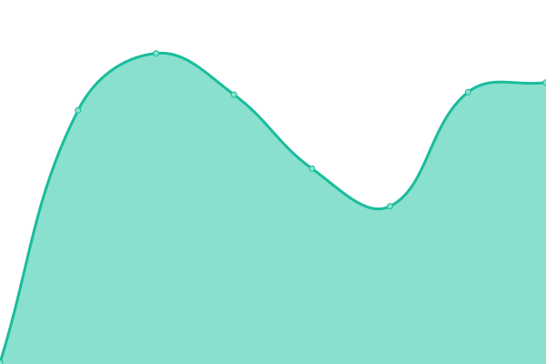
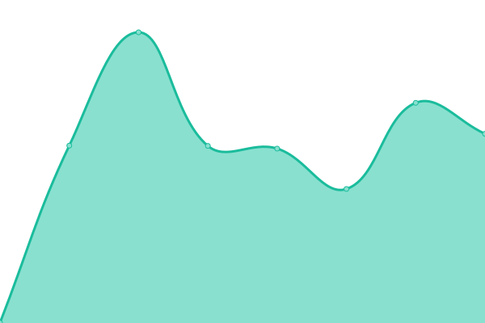
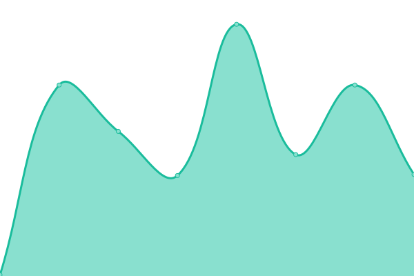

# [📈 Live Status](https://status.hightide.dev): <!--live status--> **🟧 Partial outage**

This repository contains the open-source uptime monitor and status page for [Jurre Koetse](https://status.hightide.dev), powered by [Upptime](https://github.com/upptime/upptime).

With [Upptime](https://upptime.js.org), you can get your own unlimited and free uptime monitor and status page, powered entirely by a GitHub repository. We use [Issues](https://github.com/HighTide/status.hightide.dev/issues) as incident reports, [Actions](https://github.com/HighTide/status.hightide.dev/actions) as uptime monitors, and [Pages](https://status.hightide.dev) for the status page.

<!--start: status pages-->
<!-- This summary is generated by Upptime (https://github.com/upptime/upptime) -->
<!-- Do not edit this manually, your changes will be overwritten -->
<!-- prettier-ignore -->
| URL | Status | History | Response Time | Uptime |
| --- | ------ | ------- | ------------- | ------ |
|  [hightide.dev](https://hightide.dev) | 🟩 Up | [hightide-dev.yml](https://github.com/HighTide/status.hightide.dev/commits/HEAD/history/hightide-dev.yml) | 

 163ms
     
 | 

<a href="https://status.hightide.dev/history/hightide-dev">100.00%</a>
    

|  [koetse.eu](https://koetse.eu) | 🟥 Down | [koetse-eu.yml](https://github.com/HighTide/status.hightide.dev/commits/HEAD/history/koetse-eu.yml) | 

 5498ms
     
 | 

<a href="https://status.hightide.dev/history/koetse-eu">80.33%</a>
    

|  [home.koetse.eu](https://home.koetse.eu) | 🟥 Down | [home-koetse-eu.yml](https://github.com/HighTide/status.hightide.dev/commits/HEAD/history/home-koetse-eu.yml) | 

 0ms
     
 | 

<a href="https://status.hightide.dev/history/home-koetse-eu">0.00%</a>
    

|  [koetse.nl](https://koetse.nl) | 🟥 Down | [koetse-nl.yml](https://github.com/HighTide/status.hightide.dev/commits/HEAD/history/koetse-nl.yml) | 

 609ms
     
 | 

<a href="https://status.hightide.dev/history/koetse-nl">0.00%</a>
    

|  [DatumKiezen.nl](https://DatumKiezen.nl) | 🟥 Down | [datum-kiezen-nl.yml](https://github.com/HighTide/status.hightide.dev/commits/HEAD/history/datum-kiezen-nl.yml) | 

 247ms
     
 | 

<a href="https://status.hightide.dev/history/datum-kiezen-nl">0.00%</a>
    

<!--end: status pages-->

[**Visit our status website →**](https://status.hightide.dev)

## 📄 License

- Powered by: [Upptime](https://github.com/upptime/upptime)
- Code: [MIT](./LICENSE) © [Jurre Koetse](https://status.hightide.dev)
- Data in the `./history` directory: [Open Database License](https://opendatacommons.org/licenses/odbl/1-0/)
